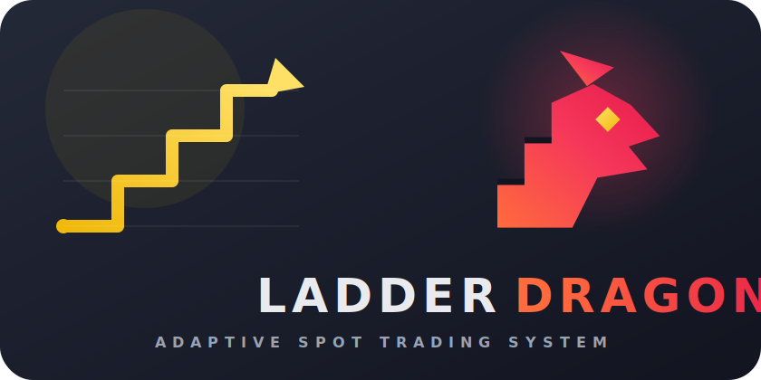

<h1 align="center">Ladder Dragon — Binance Spot Grid Bot</h1>

<p align="center">
  
</p>

<p align="center">
  <a href="https://github.com/potekhinskill/Ladder-Dragon/releases/latest"></a>
  <a href="https://github.com/potekhinskill/Ladder-Dragon/actions/workflows/security.yml"></a>
  <a href="LICENSE"></a>
</p>

> **New installation:** start with the [introduction](docs/INTRODUCTION.md).

Ladder Dragon is an open-source Python project for adaptive ladder trading on
Binance Spot. It builds BUY/SELL grids, uses ATR/EMA/VWAP/ADX regimes, manages
OCO protection, and records trading statistics in SQLite. Production secrets,
real backups, and private parameters are never committed.

Current product version: **2.10.87**. The single version source is
`product_version.py`; releases follow [Semantic Versioning](https://semver.org/).
Project contact: [LinkedIn](https://www.linkedin.com/in/ypotekhin/).

> [!WARNING]
> This software can submit real exchange orders. It is not investment advice.
> DRY is the default and Mainnet LIVE requires a separate Testnet run, limit
> review, protection verification, and explicit confirmation.

> Ladder Dragon is an independent open-source project. It is not affiliated with,
> endorsed by, sponsored by, or officially associated with Binance. Binance and
> related marks belong to their respective owners.

## Project status

Ladder Dragon is an actively developed, experimental trading system. Version
**2.10.87** is the latest signed release. `main` is the only long-lived branch;
feature branches use the `ladderdragon/*` namespace.

DRY and Binance Spot Testnet are the supported starting modes. Mainnet LIVE is
available, but it is not a general production-readiness claim: every deployment
must pass its own account reconciliation, exchange-filter, BUY-fill,
OCO/STOP, restart-recovery, gap-watchdog, backup, and circuit-breaker checks.
No profitability is promised or implied.

The bounded Mainnet canary completed a real `BUY -> fill -> OCO TP/STOP ->
restart reconciliation -> cleanup SELL` lifecycle on `SOLUSDT`. Both OCO legs
were verified, the isolated canary position was flattened exactly, no open
orders remained, and the circuit breaker stayed clear. This validates the
bounded acceptance path; it does not establish profitability or authorize
larger exposure.

## Features

- adaptive percentage ladders for multiple symbols;
- market direction, ATR, EMA, VWAP, and ADX adaptation;
- optional AI recommendations for regime, ladder width, and CAP;
- per-order, per-symbol, portfolio, reserve, and correlation limits;
- OCO/STOP protection, partial-fill recovery, gap handling, and FIFO inventory;
- SQLite decision history, cash/FIFO PnL, RAG retrieval, and reports;
- FastAPI dashboard for Raspberry health, balances, positions, orders, AI, and logs;
- encrypted rotating backups and Telegram alerts for operational failures.

## Architecture

The repository root contains only stable entry points, configuration, and docs.
Reusable code lives in `ladder_dragon` and is grouped by responsibility:

| Path | Responsibility |
| --- | --- |
| `ladder_dragon/ai/` | AI advisory, context, policy, RAG, and runtime status |
| `ladder_dragon/execution/` | Binance transport, orders, OCO/STOP, recovery, fills, fees, inventory |
| `ladder_dragon/risk/` | circuit breaker, portfolio CAP, VaR/Expected Shortfall, risk gates |
| `ladder_dragon/strategy/` | ladders, indicators, simulation, and order-book replay |
| `ladder_dragon/migrations/` | versioned SQLite migrations |
| `FastAPI/pi-dashboard/` | read-only dashboard API and host telemetry |
| `FRONT/` | static dashboard and localized help |
| `deploy/` | Raspberry, systemd, nginx, backup, and deployment scripts |
| `tests/` | unit and live-regression tests |

CLI entry points are in `bin/` and run as `python -m bin.<command>`.

## Requirements and local setup

Linux or Raspberry Pi OS is the production target. Python 3.10+ is required;
the dashboard additionally uses FastAPI, Uvicorn, and psutil.

```bash
python3 -m venv .venv
source .venv/bin/activate
python -m pip install -e '.[test,dashboard]'
cp .env.example .env
```

Keep local runtime files in a writable directory:

```dotenv
BOT_RUN_DIR=.runtime
BOT_TESTNET_RUN_DIR=.runtime/testnet
BOT_STATS_DB=.runtime/bot_stats.db
BOT_ORDER_JOURNAL=.runtime/order_intents.sqlite3
BOT_TESTNET_STATS_DB=.runtime/testnet_bot_stats.db
BOT_TESTNET_ORDER_JOURNAL=.runtime/testnet_order_intents.sqlite3
```

Systemd uses `/run/mybot`. Testnet has separate runtime, halt state, stats DB,
and order journal.

## Configuration and AI

Start with Binance Spot Testnet and a key that cannot withdraw funds. The
dashboard must use a separate read-only key. Never commit `.env`, databases,
logs, or private keys.

AI is advisory only. It receives safe market aggregates and may recommend
`UP`, `DOWN`, or `FLAT`, a ladder-width multiplier, and a CAP multiplier. It has
no order tools and cannot bypass Risk Manager. Every response is validated
locally; errors, stale context, invalid JSON, or low confidence return to the
deterministic strategy.

```dotenv
AI_ADVISOR_ENABLE=1
AI_MODE=SHADOW
AI_PROVIDER=deepseek
AI_MODEL=deepseek-v4-flash
AI_BASE_URL=https://api.deepseek.com
DEEPSEEK_API_KEY=your_key
AI_USAGE_LOG=.runtime/ai_usage.ndjson
AI_DECISIONS_DB=.runtime/ai_decisions.sqlite3
AI_CACHE_SEC=900
AI_DAILY_COST_LIMIT_USD=0.50
AI_DAILY_TOKEN_LIMIT=500000
AI_MAX_REQUESTS_PER_DAY=400
AI_RAG_TOP_K=3
AI_RAG_INCLUDE_VIRTUAL=1
```

`DISABLED` sends no requests, `SHADOW` records and evaluates recommendations
without changing the plan, and `APPLY` can affect the plan only after the
production gate. The dashboard switch changes only the advisory layer.

The decision store keeps feature snapshots, confidence, outcomes, and a short
validated rationale. Verified real closures and virtual SHADOW evaluations are
stored as separate evidence classes. Virtual documents may support offline
comparison but never count as real PnL or satisfy the APPLY production gate.
Retrievals are linked to `decision_id`, cannot use future data, and are disabled
for incomplete or stale context. RAG never fine-tunes DeepSeek.

Daily request, token, and cost limits fail closed at the next UTC day. API keys,
raw prompts, full balances, order IDs, and full order books are not written to
the usage log.

## Verification

```bash
python3 -m compileall -q .
bash -n bin/supervisor_ctl.sh
PYTHONPATH=. pytest -q
```

Safe DRY/Testnet supervisor run:

```bash
python -m bin.ai_supervisor --testnet \
  --symbols SOLUSDT,ETHUSDT --base-script ./bin/autosize_universal.py
```

Mainnet LIVE requires `BOT_LIVE_CONFIRMED=YES`, explicit `--live`, and a passed
fail-closed preflight. Never skip the preflight or circuit breaker.

### Binance Spot Testnet smoke

Public checks require no credentials and are hard-coded to Testnet:

```bash
python -m bin.binance_testnet_smoke --mode public --symbol SOLUSDT
python -m bin.binance_testnet_smoke --mode authenticated --symbol SOLUSDT
```

The optional lifecycle test creates a minimal Testnet BUY, verifies OCO, and
cleans up the test position. It never uses existing holdings:

```bash
BOT_TESTNET_BUY_OCO_CONFIRMED=YES \
python -m bin.binance_testnet_smoke --mode buy-oco-restart --symbol SOLUSDT
```

### Bounded Mainnet canary

The separate Mainnet canary is an operator-only acceptance test, not a trading
strategy. It is restricted to `SOLUSDT`, hard-capped at `10 USDT`, preserves
`RISK_RESERVE_USDT`, refuses existing SOL orders, reloads its durable journal,
verifies both OCO legs, cancels protection, and sells only the balance delta it
created. A post-BUY failure creates a persistent circuit halt. It does not use
or rewrite the cost basis of pre-existing SOL holdings.

Stop the strategy and watchdog before the test. The normal service is restarted
only after a successful result:

```bash
(
cd /home/bot/apps/binance_bot
sudo systemctl stop mybot pi-watchdog-v3.timer pi-watchdog-v3.service

set +e
sudo -u bot env \
  BOT_LIVE_CONFIRMED=YES \
  BOT_MAINNET_CANARY_CONFIRMED=YES \
  BOT_MAINNET_CANARY_CLEANUP_CONFIRMED=YES \
  PYTHONPATH=. \
  .venv/bin/python -m bin.binance_mainnet_canary \
  --symbol SOLUSDT --notional-usdt 6
RC=$?

if [ "$RC" -eq 0 ]; then
  sudo systemctl start mybot
  sudo systemctl start pi-watchdog-v3.timer
fi
exit "$RC"
)
```

The command writes a private report to `logs/mainnet_canary.ndjson` and a
separate journal to `db/mainnet_canary_order_intents.sqlite3`. It deliberately
leaves services stopped after failure; review the exact Binance state and the
circuit halt before any manual reset.

`testnet_soak_monitor.py` can monitor a long read-only run for excess BUYs,
exposure, persistent halt, missing protection, and account/ledger drift.

## Safety and accounting

The order journal records BUY/OCO intent before a request. If an ACK is lost or
the process restarts, the executor reconciles Binance by `clientOrderId` and
exchange order ID before creating protection. An uncertain submission trips a
persistent circuit halt. Partial fills, gap-below-stop, and restart recovery
are fail-closed paths.

Critical CAP, reserve, fees, inventory, FIFO PnL, and risk calculations use
`Decimal`; remaining legacy float paths are tracked engineering debt and must
not be extended. Realized net PnL includes commissions, slippage, partial fills,
exit reason, duration, and exact AI attribution. Unresolved fills are excluded
from AI PnL.

## Dashboard

Run locally with:

```bash
python -m bin.run_dashboard
```

The API listens on `127.0.0.1`. All `/api/*` routes require dashboard auth or
the explicitly configured trusted proxy. The UI supports 15 languages, stores
the selected language locally, and displays platform-aware telemetry. Raw logs
are disabled; sanitized logs are exposed only under Basic Auth at `/logs/`.

The Raspberry installer also exposes encrypted backup metadata and checksums at
`/backups/`; decrypted env files and keys are never public.

## Raspberry Pi installation and updates

Read [docs/RASPBERRY_PI_INSTALL.md](docs/RASPBERRY_PI_INSTALL.md) for the full
installation, migration, Testnet, backup, Telegram, and recovery runbook.

```bash
RELEASE_SHA="<40-character-reviewed-SHA>"
sudo bash deploy/install_raspberry_pi.sh install --commit "$RELEASE_SHA"
sudo bash deploy/update_raspberry_pi.sh update "$RELEASE_SHA"
```

Updates require a signed commit and a pinned maintainer fingerprint. See the
[Raspberry Pi runbook](docs/RASPBERRY_PI_INSTALL.md) before the first update.
Maintainers must follow the [signed release procedure](docs/RELEASING.md).

The current release-signing fingerprint is:

```text
808B9F52CB6C08901703EF7C113144122F1830A0
```

Normal updates read this trust anchor only from root-owned
`/etc/ladder-dragon/update-trust.conf`. Environment variables cannot disable
signature verification. Unsigned recovery requires the separate interactive,
journaled, one-use break-glass procedure described in the runbook.

The updater creates an encrypted backup, preserves `.env` and `.env.dashboard`,
updates only the requested fast-forward commit, validates Python/nginx, restarts
the services, and waits for a fresh heartbeat.

## Remaining engineering work

- validate `PERCENT_PRICE_BY_SIDE` before placing holdings SELL orders and reject
  implausible prices locally;
- reconcile legacy holdings cost basis before enabling `auto_oco_holdings`;
- run the bounded Mainnet canary on each materially changed executor release;
- add a separate non-destructive gap-watchdog acceptance drill; the active
  canary does not manufacture a market gap;
- extend event-driven replay with archived Binance depth/trade streams;
- improve matching, latency, maker/taker, and market-impact models;
- expand multi-period walk-forward and production approval statistics;
- continue reducing float arithmetic and broad exception handlers;
- run controlled long Testnet soak tests after executor or risk changes.

## Documentation and license

- [Introduction](docs/INTRODUCTION.md)
- [Raspberry Pi runbook](docs/RASPBERRY_PI_INSTALL.md)
- [Dashboard help](FRONT/help.html)
- [Changelog](CHANGELOG.md)
- [Security policy](SECURITY.md)
- [Contributing](CONTRIBUTING.md)
- [Trademark policy](TRADEMARKS.md)
- [Third-party notices](THIRD_PARTY_NOTICES.md)
- [MIT License](LICENSE)
- [Disclaimer](DISCLAIMER.md)

Copyright: IURII Potekhin / Ladder Dragon. Public contact:
[LinkedIn profile](https://www.linkedin.com/in/ypotekhin/).
