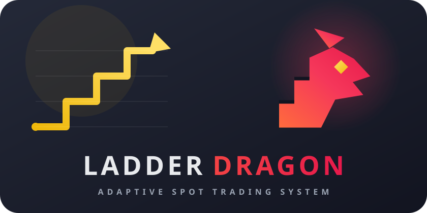
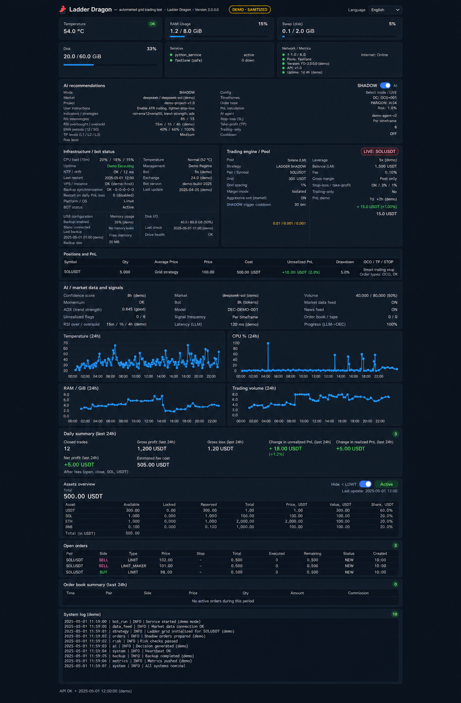

<h1 align="center">Ladder Dragon</h1>

<p align="center"><strong>Adaptive Binance Spot execution with exchange protection, exact accounting, and fail-closed operation.</strong></p>

<p align="center">
  
</p>

<p align="center">
  <a href="https://github.com/potekhinskill/Ladder-Dragon/releases/latest"></a>
  <a href="https://github.com/potekhinskill/Ladder-Dragon/actions/workflows/security.yml"></a>
  
  
  <a href="https://github.com/potekhinskill/Ladder-Dragon/stargazers"></a>
  <a href="LICENSE"></a>
</p>

<p align="center">
  <a href="#quick-start">Quick start</a> ·
  <a href="#safety-model">Safety model</a> ·
  <a href="#verification">Verification</a> ·
  <a href="#dashboard">Dashboard</a> ·
  <a href="docs/RASPBERRY_PI_INSTALL.md">Raspberry Pi</a> ·
  <a href="#documentation">Documentation</a>
</p>

Ladder Dragon is an open-source Python trading system for Binance Spot.
It uses adaptive entry ladders and exchange-side protection.
It also provides exact accounting, restart recovery, replay, and walk-forward tests.

Current product version: **2.20.218**.
The version source is `product_version.py`.
Releases use [Semantic Versioning](https://semver.org/).

> [!WARNING]
> This software can submit real exchange orders.
> It is not investment advice.
> DRY is the default mode.
> Mainnet LIVE requires Testnet evidence, reviewed limits, verified protection, and explicit confirmation.

Ladder Dragon is not affiliated with Binance.
Binance does not endorse or sponsor this project.

## Purpose

The system does not try to predict each price tick.
It makes each trading decision bounded, visible, recoverable, and measurable.

| Risk | Control |
| --- | --- |
| A process stops after a fill | Durable intent journal and Binance reconciliation |
| A BUY has no protection | Verified OCO or STOP protection and fail-closed recovery |
| Cash flow looks like profit or loss | Separate cash flow, portfolio movement, and FIFO net PnL |
| A test uses future data | Sequential replay and purged walk-forward validation |
| AI exceeds its authority | Advisory-only AI behind Risk Manager |
| A small host fails silently | Dashboard, health checks, backups, and Telegram reports |

## Main functions

- Adaptive BUY ladders use ATR, EMA, VWAP, ADX, and market regimes.
- Risk Manager controls reserve, CAP, daily loss, spread, freshness, and gap risk.
- The executor records an intent before it sends an exchange mutation.
- Filled managed BUY quantity requires verified exchange-side SELL protection.
- FIFO accounting uses exact quantities, prices, commissions, and trade identifiers.
- Replay processes archived market events in time order.
- Walk-forward tests train only on older evidence.
- SHADOW prediction and market scenarios collect evidence without changing orders.
- The dashboard provides read-only host, account, order, risk, and AI status.
- The dashboard shows a verified update notice during an active IP whitelist block.
- Telegram sends concise health alerts and exact daily trading reports.
- A successful update sends one English IP whitelist notice when trading stays blocked.

## Safety model

DRY and Binance Spot Testnet are the supported start modes.
LIVE does not mean that a deployment is ready for production.
Each account and host must pass its own verification.

The following controls always apply:

- AI cannot submit or cancel an order.
- AI cannot bypass HALT, CAP, reserve, or loss limits.
- SHADOW cannot change BUY, TP, STOP, CAP, or an exchange order.
- APPLY requires operator approval and valid statistical evidence.
- RAG uses only verified real closures with exact net PnL.
- Unknown commissions do not become zero commissions.
- Incomplete FIFO history does not produce numeric realized PnL.
- Managed inventory and legacy inventory remain separate.
- Read uncertainty does not permit removal of exchange protection.
- An unknown mutation result enters reconciliation or HALT.

Read [Runtime safety and reporting](docs/RUNTIME_SAFETY_AND_REPORTING.md) for the full contracts.

## Architecture

The repository uses a package-first structure.
Files in `bin/` are command-line launchers.
Reusable logic is in `ladder_dragon/`.

| Path | Responsibility |
| --- | --- |
| `ladder_dragon/ai/` | AI advice, context, RAG, and evidence |
| `ladder_dragon/dashboard/` | dashboard API and telemetry services |
| `ladder_dragon/market_analysis/` | public multi-symbol scenario collection and evidence |
| `ladder_dragon/execution/` | transport, orders, protection, fills, recovery, and accounting |
| `ladder_dragon/persistence/` | database connections and migrations |
| `ladder_dragon/risk/` | circuit breaker, limits, CAP, VaR, and Expected Shortfall |
| `ladder_dragon/strategy/` | ladders, indicators, prediction, simulation, and replay |
| `ladder_dragon/supervision/` | per-symbol planning and worker control |
| `ladder_dragon/verification/` | local, release, Testnet, and Raspberry Pi checks |
| `deploy/` | systemd, nginx, backup, and update scripts |
| `FRONT/` | dashboard assets and locales |
| `tests/` | unit, regression, safety, and deployment tests |

See [Architecture](docs/ARCHITECTURE.md) for dependency rules and current module boundaries.

## Quick start

Read the [Introduction](docs/INTRODUCTION.md) before you configure exchange access.

Python 3.10 or a later compatible version is required.
Use the project virtual environment for every command.

```bash
python3 -m venv .venv
source .venv/bin/activate
python -m pip install -e '.[test,dashboard]'
cp .env.example .env
```

Keep local runtime data outside tracked source files.

```dotenv
BOT_RUN_DIR=.runtime
BOT_TESTNET_RUN_DIR=.runtime/testnet
BOT_STATS_DB=.runtime/bot_stats.db
BOT_ORDER_JOURNAL=.runtime/order_intents.sqlite3
BOT_TESTNET_STATS_DB=.runtime/testnet_bot_stats.db
BOT_TESTNET_ORDER_JOURNAL=.runtime/testnet_order_intents.sqlite3
```

Never commit `.env`, a database, a log, an archive, or a private key.
Use a separate read-only Binance key for the dashboard.

## AI and prediction

AI is an advisory component.
It receives validated market aggregates and has no order tools.
Invalid output selects the deterministic strategy.
Provider errors also select the deterministic strategy.

The standard prediction layer records these horizons:

- 1 minute;
- 5 minutes;
- 15 minutes.

The Raspberry Pi stores prediction evidence in this database:

```text
/home/bot/apps/binance_bot/db/prediction_shadow.sqlite3
```

It records probability, expected net PnL, adverse movement, and execution time.
Historical features use an as-of cutoff.
Walk-forward splits exclude labels that were not available at the test time.
Operational reports use the latest 1,000 decisions for each candidate.
The database keeps all raw decisions and outcomes.

Selection compares candidates on shared future snapshots.
Every candidate must have the same selection snapshot set.
Selection evidence is diagnostic and cannot confirm its selected candidate.
An operator freezes one explicit candidate before independent confirmation starts.
The frozen manifest uses canonical JSON and SHA-256 fingerprints.
Confirmation uses only decision snapshots after its purged time boundary.
It removes snapshots with overlapping 360-minute outcome intervals.
It then uses ten non-overlapping blocks of 12 independent decisions.
At least nine blocks must have positive PnL and positive baseline edge.
An unresolved decision stops the eligible prefix until its outcomes close.
Reports are read-only, and explicit finalization binds the reviewed report SHA-256.
The existing 120-sample, confidence, Holm, fill, drawdown, and regime checks remain mandatory.

The first gate evaluates a complete strategy replacement.
It includes the opportunity cost of `NO_TRADE` periods.
An active-entry cohort reports candidate quality inside its permitted regime.
This diagnostic cohort cannot approve APPLY.
The first gate can only permit a separate second-gate review.
It cannot permit APPLY or change an order.

The defensive ensemble can stop a BUY or reduce CAP.
It cannot expand baseline risk.
The statistical gate requires a positive lower confidence bound and Holm correction.

## Replay and backtest

The replay engine processes JSONL market events in sequence.
It models L2 market data and local price-time priority.
It does not claim exact Binance L3 reconstruction.

Run an OHLC backtest:

```bash
.venv/bin/python -m bin.backtest data.csv --output report.json
```

Run an archived event replay:

```bash
.venv/bin/python -m bin.backtest data.csv \
  --archive archive.jsonl \
  --calibration calibration.json \
  --output report.json
```

Replay evidence must include archive hashes and measured latency.
Validation compares simulated outcomes with real terminal order outcomes.
Readiness permits one validation report for each calibration archive.
Duplicate archive reports block approval and cannot increase validated-order totals.

## Verification

Use one verification harness in local work, CI, release work, and deployment.

Create the isolated Semgrep environment before local or release verification:

```bash
python3 -m venv .semgrep-venv
.semgrep-venv/bin/python -m pip install \
  --require-hashes -r requirements/semgrep.lock
```

The local and release profiles test the project rules and scan production code.
The scan uses local rules, disables metrics, and does not require network access.
The scanner receives a minimal environment without application credentials.
The Raspberry Pi profile does not install or run Semgrep.

```bash
.venv/bin/python -m bin.verification_harness --profile local
.venv/bin/python -m bin.verification_harness --profile release
.venv/bin/python -m bin.verification_harness --profile testnet
.venv/bin/python -m bin.verification_harness --profile pi
```

The profiles use these exit codes:

- `0`: PASS;
- `1`: FAILED;
- `2`: BLOCKED.

BLOCKED is not PASS.
Do not delete evidence or weaken a gate to change this result.

Run the minimum local checks:

```bash
.venv/bin/python -m compileall -q .
PYTHONPATH=. .venv/bin/python -m pytest -q
.venv/bin/python -m bin.check_technical_english
.venv/bin/python -m bin.semgrep_scan --rules-test
.venv/bin/python -m bin.semgrep_scan
git diff --check
```

The release profile must use the final signed candidate commit.
Deploy only the exact 40-character SHA from its PASS report.

## Dashboard

The private dashboard shows these groups:

- host and service health;
- account value and balances;
- managed position protection;
- legacy inventory outside bot control;
- open and filled orders;
- exact FIFO reports;
- risk and HALT state;
- SHADOW evidence and AI quality;
- latency and 24-hour charts.

The chart grid includes temperature, CPU, memory, and trading volume.
Trading volume is the rolling 24-hour executed quote turnover.



The image contains demonstration data.
It contains no live credentials, balances, identifiers, orders, or timestamps.

## Telegram reports

The daily timer runs at 08:00 in `Asia/Almaty`.
It reports yesterday and the last 7 and 30 complete days.

The report includes fills, commissions, cash flow, and exact FIFO net PnL.
Fees use a negative sign because they reduce net PnL.
An incomplete symbol appears in an exclusion list.
The system does not invent a cost basis.

Operational alerts use persistent transition deduplication, recovery hysteresis, and a disk outbox.
Old outbox messages expire before delivery.

## Raspberry Pi

Use the reviewed installer and update runbook.
Do not copy a local `.env` into the repository.

Install or update only from an exact reviewed commit:

```bash
sudo bash deploy/update_raspberry_pi.sh update <40-character-SHA>
```

The updater preserves service state and creates an encrypted backup.
Backup archives use checksum verification before atomic publication.
The dashboard requires status evidence for the exact archive name, size, and SHA-256.
It verifies the commit, dependencies, dashboard assets, services, and heartbeat.
It does not replace live environment files.

Read the [Raspberry Pi runbook](docs/RASPBERRY_PI_INSTALL.md) before each host change.

## Project status

Ladder Dragon is experimental software.
No profitability is promised or implied.

The bounded Mainnet canary proved one small BUY-to-protection lifecycle.
The result does not authorize more exposure.
Natural closed lifecycles and a continuous soak remain approval evidence.

The canary has a hard `10 USDT` notional limit.
Run it only with all explicit LIVE confirmations:

```bash
.venv/bin/python -m bin.binance_mainnet_canary \
  --symbol SOLUSDT --notional-usdt 6 \
  --max-commission-usdt 0.02
```

Read the runbook before you run this paid acceptance test.

`main` is the only branch that can exist on GitHub.
Local work uses temporary `ladderdragon/*` branches.

The exact implemented and approval states are in
[Implementation status](docs/IMPLEMENTATION_STATUS.md).

## Remaining engineering work

- Repeat the controlled Testnet User Data Stream drill after a relevant transport change.
- Stabilize the Mainnet v4 transport-failure reconnect rate and obtain a continuous 24-hour PASS.
- Close overdue outcomes and review journal-proven attribution gaps without inventing a `decision_id`.
- Validate replay results against more real terminal order lifecycles.
- Compare SOLUSDT version-fourteen lifetimes at a 48 basis-point gap.
- Compare ETHUSDT version-thirteen gaps of 20, 21, and 22 basis points.
- Continue BTCUSDT version-twelve evidence without enabling its execution.
- Approve separate BTCUSDT and ETHUSDT CAPs only after confirmation.
- Freeze one selected candidate before collecting independent confirmation evidence.
- Keep strategy changes in SHADOW until every statistical gate passes.
- Continue the planned extraction of large runtime coordinators.

The v4 stream epoch separates planned reconnects from transport failures.
The observer keeps all older epoch counters as immutable lifetime evidence.

## Star history

<p align="center">
  <a href="https://github.com/potekhinskill/Ladder-Dragon/stargazers">
    
  </a>
</p>

GitHub Pages rebuilds this chart after a new star and reconciles it each hour.
The chart contains only dates and cumulative counts.
It does not publish account names.

## Documentation and license

- [Introduction](docs/INTRODUCTION.md)
- [Architecture](docs/ARCHITECTURE.md)
- [Raspberry Pi runbook](docs/RASPBERRY_PI_INSTALL.md)
- [Release procedure](docs/RELEASING.md)
- [Runtime safety and reporting](docs/RUNTIME_SAFETY_AND_REPORTING.md)
- [Implementation status](docs/IMPLEMENTATION_STATUS.md)
- [Configuration reference](docs/CONFIGURATION.md)
- [Command and service reference](docs/COMMAND_REFERENCE.md)
- [Local runtime artifacts](docs/LOCAL_ARTIFACTS.md)
- [Data retention](docs/DATA_RETENTION.md)
- [Technical English standard](docs/TECHNICAL_ENGLISH.md)
- [Validated engineering decisions](DECISIONS.md)
- [Engineering mistakes and root causes](MISTAKES.md)
- [Changelog](CHANGELOG.md)
- [Security policy](SECURITY.md)
- [Contributing](CONTRIBUTING.md)
- [MIT License](LICENSE)
- [Disclaimer](DISCLAIMER.md)

Copyright: IURII Potekhin / Ladder Dragon.
Project contact: [LinkedIn](https://www.linkedin.com/in/ypotekhin/).
