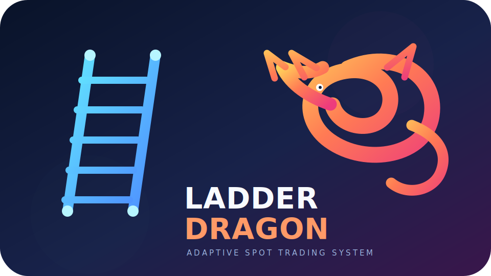

<p align="center">
  
</p>

<h1 align="center">Ladder Dragon</h1>

<p align="center">Adaptive Binance Spot ladder trading with Risk Manager, OCO protection, backtest/replay, and a read-only dashboard.</p>

> Important: the project defaults to `DRY`/`Testnet`. LIVE requires a separate approval, protection checks, and manual supervision.

## What it is

Ladder Dragon combines four layers:

1. **Strategy** — BUY/SELL ladders, ATR/EMA/VWAP/ADX, and market regimes.
2. **Execution** — Binance transport, fills, OCO/STOP, FIFO inventory, and recovery.
3. **Risk** — reserve, CAP, circuit breaker, reconciliation, and fail-closed gates.
4. **AI advisory** — SHADOW recommendations and RAG context without order access.

## Supported platforms

| Platform | Purpose | Recommendation |
| --- | --- | --- |
| Raspberry Pi OS 64-bit | persistent service, dashboard, and backups | primary production/Testnet target |
| Linux Debian/Ubuntu | development, backtest, and Testnet | full local support |
| macOS | development, tests, and backtest | supported without systemd; DRY/Testnet only |
| Windows + WSL2 Ubuntu | development and tests | supported; native Windows execution is not claimed |

Production uses Linux `systemd`, `/proc`, `fcntl`, `vcgencmd`, nginx, and file
policies. Native Windows and macOS are not replacements for the Raspberry server.

## Quick Raspberry Pi start

### 1. Prepare the host

Use a Raspberry Pi 4/5, 64-bit Raspberry Pi OS Lite, SSH, stable power, and a
correctly synchronized clock.

```bash
sudo apt update
sudo apt full-upgrade -y
sudo apt install -y git openssh-client ca-certificates
sudo timedatectl set-timezone Asia/Almaty
timedatectl status
```

### 2. Clone the private repository

Create a read-only GitHub deploy key and add it under **Repository → Settings →
Deploy keys**. Then clone the approved branch:

```bash
sudo install -d -o bot -g bot -m 0750 /home/bot/apps
sudo -u bot git clone --branch codex/safety-hardening --single-branch \
  git@github.com:potekhinskill/Ladder-Dragon.git /home/bot/apps/binance_bot
```

### 3. Install the safe defaults

```bash
cd /home/bot/apps/binance_bot
RELEASE_SHA="$(sudo -u bot git rev-parse HEAD)"
sudo bash deploy/install_raspberry_pi.sh install --commit "$RELEASE_SHA"
```

The clean installer leaves `Testnet + DRY`, creates systemd/nginx/dashboard,
protects `/logs/` and `/backups/`, and keeps secrets outside Git.

### 4. Add Testnet credentials

```bash
sudo -u bot nano /home/bot/apps/binance_bot/.env
```

Use only the Testnet block while validating the system:

```dotenv
BINANCE_TESTNET_API_KEY=...
BINANCE_TESTNET_API_SECRET=...
BINANCE_TESTNET_API_BASE=https://testnet.binance.vision
BOT_LIVE_CONFIRMED=NO
AI_ADVISOR_ENABLE=0
AI_MODE=SHADOW
```

```bash
sudo chown bot:bot /home/bot/apps/binance_bot/.env
sudo chmod 600 /home/bot/apps/binance_bot/.env
sudo systemctl restart mybot
```

### 5. Verify services and the dashboard

```bash
sudo systemctl is-active mybot pi-healthd
curl -sk -u dashboard https://bot.local/api/health
curl -sk -u dashboard https://bot.local/api/ai/status
```

Open `https://bot.local/`. The dashboard password is stored only on the Pi:

```bash
sudo cat /root/ladder-dragon-dashboard-credentials.txt
```

### 6. Finish Testnet validation first

```bash
cd /home/bot/apps/binance_bot
sudo systemctl stop mybot
sudo -u bot env PYTHONPATH=. .venv/bin/python -m pytest -q
sudo -u bot env PYTHONPATH=. .venv/bin/python \
  binance_testnet_smoke.py --mode public --symbol SOLUSDT
sudo systemctl start mybot
```

Mainnet LIVE is allowed only after checking balances, filters, OCO/STOP,
gap/restart recovery, circuit breaker, and a real Testnet BUY → fill → protection
→ exit lifecycle.

## Linux, macOS, and Windows

On Debian/Ubuntu or macOS, create a virtual environment and keep runtime files
in `.runtime`:

```bash
git clone https://github.com/potekhinskill/Ladder-Dragon.git
cd Ladder-Dragon
python3 -m venv .venv
source .venv/bin/activate
python -m pip install -e '.[test,dashboard]'
cp .env.example .env
export BOT_RUN_DIR=.runtime
PYTHONPATH=. pytest -q
```

Use macOS for development, backtests, and Testnet only. On Windows use WSL2
Ubuntu and follow the Linux steps; native Windows LIVE is not supported.

## Safety checklist

- Never commit `.env`, `.env.dashboard`, API keys, Telegram tokens, SQLite data,
  backup archives, or real logs.
- Use a separate read-only Binance key for the dashboard.
- Start with Testnet, then DRY, and only after a separate review use limited LIVE.
- Review Git history for secrets and production configuration before publishing.

See [RASPBERRY_PI_INSTALL.md](RASPBERRY_PI_INSTALL.md), [README.md](../README.md),
[LICENSE](../LICENSE), and [DISCLAIMER.md](../DISCLAIMER.md).
